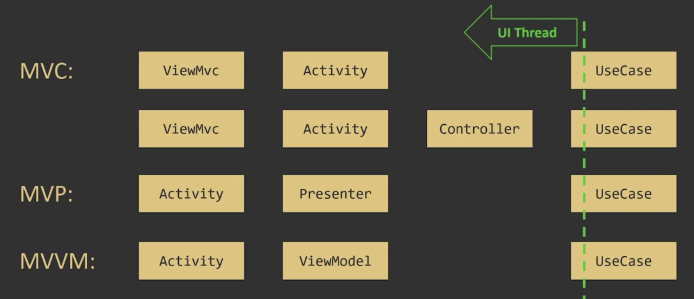

# NOTES ABOUT LECTURE

## Structured Concurrency

It is an ability to "pause" code execution and "wait" for all concurrent flows which can be traced
back to a specific "ancestor" to complete

Kotlin coroutines provide advanced support for Structured Concurrency in production code and
unit tests

> **BEST PRACTISE :** Suspending function should not assume anything about dispatchers on which
they are called. Always specify context inside suspend function

## Design with Coroutines

Presentation Layer Logic:

- UI logic

- Android controllers (Activities, Fragments)

- Standalone controllers (controllers, presenters, viewmodels, etc.)

**There should be no multithreading in these entities** Presentation layer should use UI thread
exclusively! There should be only UI thread related jobs in these entities.
Instead use UseCase's(interactors) for operations (Background thread operations) which needs
to run on other threads

