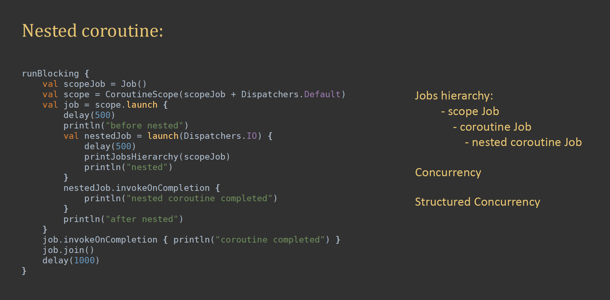
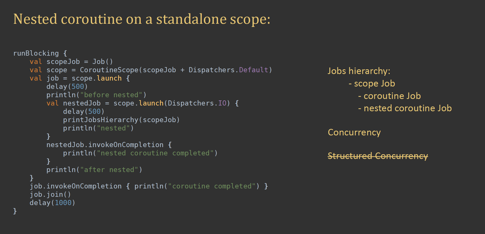

# NOTES ABOUT LECTURE

## Structured Concurrency

It is an ability to "pause" code execution and "wait" for all concurrent flows which can be traced
back to a specific "ancestor" to complete

Kotlin coroutines provide advanced support for Structured Concurrency in production code and
unit tests

> **BEST PRACTISE :** Suspending function should not assume anything about dispatchers on which
they are called. Always specify context inside suspend function

## Design with Coroutines

Presentation Layer Logic:

- UI logic

- Android controllers (Activities, Fragments)

- Standalone controllers (controllers, presenters, viewmodels, etc.)

**There should be no multithreading in these entities** Presentation layer should use UI thread
exclusively! There should be only UI thread related jobs in these entities.
Instead use UseCase's(interactors) for operations (Background thread operations) which needs
to run on other threads


## Dispatchers

Dispatchers are responsible for “dispatching” coroutines
to the underlying threads

List of Dispatcher in Android:

- Dispatchers.Main

- Dispatchers.Main.immediate

- Dispatchers.Default

- Dispatchers.IO

- Dispatchers.unconfined

What’s the added benefit of “immediate” Main Dispatcher?

### Dispatchers.Main

Behaves like Handler( Looper.getMainLooper ()). 
(It will be added to main thread queue and will be called when in turn)

### Dispatchers.Main.immediate

Behaves like Activity.runOnUiThread (it will be run immediately)

> **Best Practise : ** Use Dispatchers.Main.immediate to execute code on UI thread, 
unless you have a reason not to 

### Dispatchers.Default

Thread pool with maxThreads = max(2, NUM_OF_CPU_CORES)

Used for computation intensive tasks

### Dispatchers.IO:

Thread pool with maxThreads = max(64, NUM_OF_CPU_CORES)

Maximum number of threads can be further increased by adjusting system proprties

Used for IO tasks (tasks which are mostly “waiting”)

> Use Dispatchers.IO for time consuming tasks like network request, db operations, writing or
reading from file etc.

## Coroutines Cancellation

Two methods used to cancel coroutine

- coroutineScope.coroutineContext.cancelChildren

- coroutineScope.cancel

> cancelled: CoroutineScope becomes “dead” and can’t be used to launch new
coroutines (silently discards launch attempts)

Whenever a coroutine cancelled, a CancellationException thrown -
as long as withContext (or delay) function is called inside the suspending function.

E.g.

```kotlin
suspend fun executeBenchmark(benchmarkDurationSeconds: Int) = withContext(Dispatchers.Default) {
   // code goes here
}
```

We use isActive or coroutineContext.isActive to check if coroutine is not cancelled yet inside
suspending function.

*ensureActive()* : Check if coroutine still active otherwise throws CancellationException

### Non-cancellable Jobs

We use non-cancellable jobs to make sure all tasks completed -even if
it is cancelled in the middle of execution- in suspending function.

Example: updating db after network response

Usage:

```kotlin
withContext(NonCancellable)
// --------- or -----------
withContext(Dispatchers.Default + NonCancellable)
```

### Coroutine Mechanics

Main building blocks of coroutines:

- CoroutineScope

- CoroutineContext

- CoroutineDispatcher

- Job

CoroutineScope needs context in order to initialize. And that context arguments could be : Job - CoroutineName - Dispatcher

```kotlin
CoroutineScope(Job() + CoroutineName("outer scope") + Dispatchers.IO)
```

Same rules available for coroutineScope.launch method

> Launching a new coroutine is concurrent process, unlike withContext block which is stuctured concurrency works.
withContext simply uses to change context (thread)

Whenever coroutine launch method calls new CoroutineScope and Job creates.

> *job.join()* method uses on unit test inorder to wait for corotine job end

There is a hierarchy between the coroutine jobs which is called inside other.
Check out : CoroutinesMechanicsExplorationsTest.coroutineScope_jobsHierarchy()

Until there is no specific declaration made, coroutines uses outer scopes data.

> *withContext* block checks for cancellation signal on the begining and the end of the code lines

> **IMPORTANT NOTE: **NonCancellable is designed for withContext exclusively!

Nested WithContext Examination


Nested Coroutine Examination



Nested Coroutine On Standalone Scope Examination



## REFERENCES

https://www.udemy.com/course/kotlin-coroutines-in-android