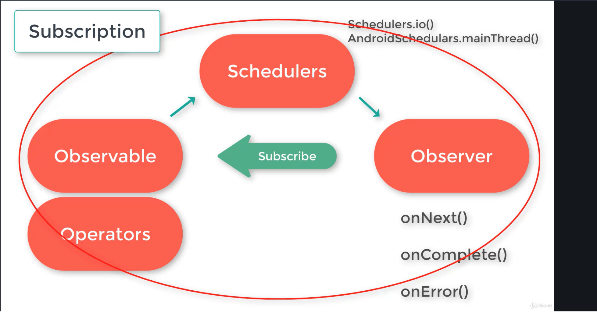

# SUMMARY

Data strems can be used for;
- Click events
- Network calls
- Data storage
- Variable changes
- Errors

Modules run on their own threads, executing multiple code blocks at the same time.

## What is Reactive Programming

In computing, reactive programming is a declarative programming paradigm concerned with data streams and the propagation of change.

With this paradigm it is possible to express static (e.g., arrays) or dynamic (e.g., event emitters) data streams with ease, and also communicate that an inferred dependency within the associated execution model exists, which facilitates the automatic propagation of the changed data flow.

In reactive programming, the consumer code blocks react to the data as it comes in.

## What is ReactiveX

Provides implementation on reactive programmig for different programming languages.

Word mean : Reactive Extensions

ReactiveX is a combination of the best ideas from the Observer pattern, the Iterator pattern, and functional programming

RxJava is composable, Rx operators can be combined to produce more complicated operations

Error handling becomes much easier with RxJava. You don’t need to worry about adding try catch blocks everywhere.

In mobile applications, we cannot control the app lifecycle. Sometimes we need to terminate current processes rapidly to response to a app lifecycle change. RxJava provide simple yet profound mechanism to terminate background processes rapidly.

## RxJava

RxJava makes multi-threading super easy. Using imperative approach, moving a piece of code to background thread is hard work. However in RxJava, we could easily define what thread each part of the chain would be in

RxJava is composable, Rx operators can be combined to produce more complicated operations.

Rx operators can transform one type of data to another, reducing, mapping or expanding streams as needed.

## General Structure

Observable emits  data,Observer gets data.

### Observables

Observables observe data streams and emit them to subscribed Observers

### Observers

Observers consume data emitted by the Observables.

One Observable can have many observers. An observable emit data, if there is at least one observer subscribed for the data. If there is no subscription observable will not emit data.

Main observer methods(there are other methods too)

- onNext() :- Each time an Observable emits data it  calls to Observer's  onNext() method  passing that data.

- onError() :- If any error occur Observable calls to Observer's onError() method.

- onComplete() :- Observable invokes Observer's onComplete() method, when the data emission is over.

### Schedulers

Use to perform operations of Observable on different threads(multi-threading)

#### Schedulers.io()

This can have a limitless thread pool. Used for non CPU intensive tasks. Such as database interactions, performing network  communications and interactions with the file system.

#### AndroidSchedulers.mainThread()

This is the main thread or the UI thread. This is where user interactions happen

#### Schedulers.newThread()

This scheduler creates a new thread for each unit of work scheduled.

#### Schedulers.single()

This scheduler has a single thread executing tasks one after another following the given order.

#### Schedulers.trampoline()

This scheduler executes tasks following first in, first out basics.We use this when implementing recurring tasks.

#### Schedulers.from(Executor executor)

This creates and returns a custom scheduler backed by the specified executor.

### Operators

Use to Modify data which emits from observable

#### Just Operator

Emit all item at once, ignoring item type even if item type is array

#### FromArray Operator

Emit all array items one by one

// IMPORTANT : in kotlin this operator is not working, cause:

According to their doc fromArray() only supports reference arrays. But in kotlin arrayOf<Int>() returns Array object. If we put a kotlin Array object in fromArray() method, it creates array of Array object (in java, it will be Array[]). So after subscription Observable returns that object of Array. But if we put items in fromArray() method, it will create array of Int. So after subscription it returns Int. If you want to iterate over any mutable iterable, then you can try Observable.fromIterable()

#### Range Operator

Creates an observable that emits a particular range of sequential integers

#### Create Operator

Create an Observable from scratch ny means of a function

#### Map Operator

Transform the items emitted by an Observable by applying a function to each item

#### FlatMap Operator

Transform the items emitted by an Observable into Observables, then flatten the emissions from those inte a single Observable

The difference between Map and FlatMap operators, FlatMap operator returns Observable

FlatMap operator is useful when calling queued network requests

#### ConcatMap Operator

Same as FlatMap but cares about order of the emitted items. But ConcatMap is not useful for efficient/performance wise

#### Buffer Operator

Periodically gather items emitted by an Observable into bundles and emit these bundles rather than emitting the items one at a time

#### Filter Operator

Filters the emitted items by create predicate

#### Distinct Operator

Supress duplicate items emitted by an Observable

#### Skip Operator

Suppress the first n items emitted by an Observable

### Disposables

In mobile applications we cannot control the app life-cycle. Let’s say in an app you created you have written code to run a network call to a REST API and update the view accordingly. If a user initiate a view but decide to go back before the completion of the network call, What will happen? The activity or fragment will be destroyed. But the observer subscription will be there. When observer trying to update the User Interface, in this scenario as the view already destroyed,  it can cause a memory leak. And your app will freeze or crash as a result.

In order to prevent that problem we use disposables and dispose all thread operations on screen lifecycle ends

### Disposable Observers

DisposableObserver class implements both Observer and Disposable interfaces. DisposableObserver is much efficient than Observer if you have more than one observers in the activity or fragment.

### Composite Disposables

In one class you can have more than one observers . So you will have so many observers to dispose. When we have more than one observers we use CompositeDisposable. By that way we can dispose all observers in one place with "clear" method on "CompositeDisposable".

### What is the difference between clear() and dispose() ?

When you are using CompositeDisposable, If you call to dispose() method, you will no longer be able to add disposables to that composite disposable.

But if you call to clear() method you can still add disposable to the composite disposable . Clear() method just clears the disposables that are currently held within the instance.

### Subject

A Subject is a sort of bridge or proxy that is available in some implementations of ReactiveX that acts both as an observer and as an Observable. Because it is an observer, it can subscribe to one or more Observables, and because it is an Observable, it can pass through the items it observes by reemitting them, and it can also emit new items.

#### Async Subject

Only emits the last value of the Observable.

#### Behavior Subject

Emits the most recently emitted item and all the subsequent items of the  Observable.

#### Publish Subject

Emits all the subsequent items of the source Observable at the time of subscription.

#### Replay Subject

Emits all the items of the source Observable, regardless of when the subscriber subscribes.

### BACKPRESSURE

When the Observer is not able to consume items as quickly as they are produced by an Observable they need to be buffered or handled in some other way, before they fill up the memory, finally causing OutOfMemoryException

Example : If an observer can handle only 1000 items per second,  but its Observable emits 100000 items per second

RxJava, Introduced **Flowable** class for handling the backpressure.

#### FLOWABLES

We can easily create a Flowable from any object or value using just operator . Like we did with for the Observable.

This is the simplest way. But, widely used approach to create a flowable  is toFlowable() method.

We can invoke any observables ‘s toFlowable method passing BackpressureStrategy as an argument.

Flowable works according to pub-sub pattern, i.e publisher - subscriber pattern; whereas, Observable works according to observer pattern

#### Backpressure strategies

##### BackpressureStrategy.DROP

We use this to discard the events that cannot be consumed by the Observer.

##### BackpressureStrategy.BUFFER

If we use this, the source will buffer all the events until the subscriber can consume them. I recommend this strategy for most of the use cases, because there will be no data loss with this strategy.

##### BackpressureStrategy.LATEST

BackpressureStrategy.LATEST, force  to the source to keep only the latest items, to do that source may need to  overwrite some previous values .

##### BackpressureStrategy.MISSING

We may temporary  pass this value, if we don’t want any backpressure stratergy.

##### BackpressureStrategy.ERROR

If we don’t expect backpressure at all, we can pass BackpressureStrategy.ERROR

PS: In both of the cases( BackpressureStrategy.MISSING,  BackpressureStrategy.ERROR  ), a MissingBackpressureException will be thrown if the observer can’t keep up with the data emitting speed of the source.

## REFERENCES

- https://www.udemy.com/course/rxjavarxandroid-bootcamp-reactivex-for-android-developers

- http://reactivex.io/documentation